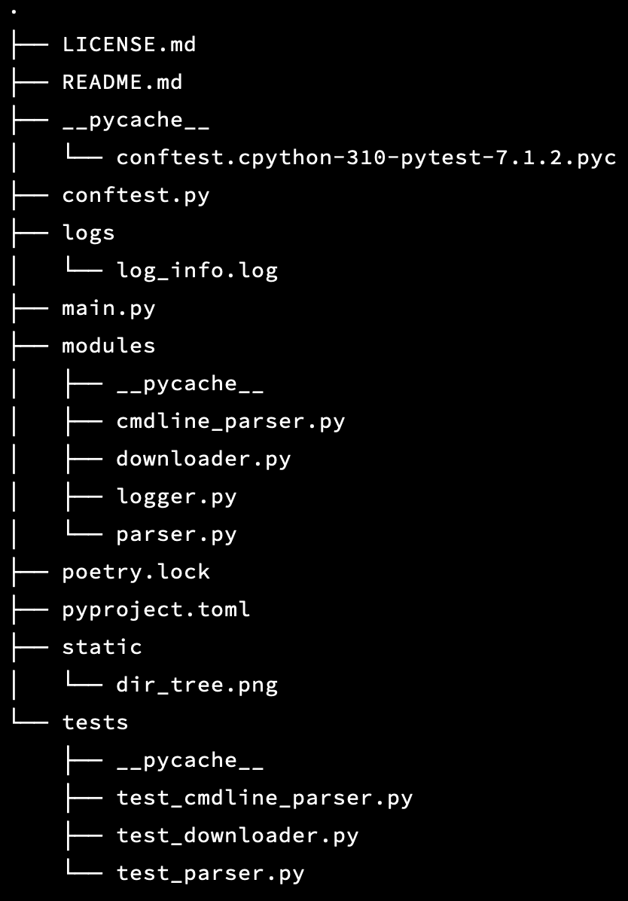

## Python Command Line Tool for Debian Packages

Download and Get Package Statistics for a given architecture

<!-- TOC -->

* [Python Command Line Tool for Debian Packages](#python-command-line-tool-for-debian-packages)
    * [General Directory Structure](#general-directory-structure)
    * [Basic Project Info](#basic-project-info)
    * [Project Description | Approach](#project-description--approach)
    * [Other files](#other-files)

<!-- TOC -->

#### General Directory Structure

#### Basic Project Info

- package and dependency management tool - Poetry
- VCS - git
- major [pre-commit hooks](./.pre-commit-config.yaml) for formatting code
    - black
    - flake8
    - isort
- license - [MIT](./LICENSE.md)
- *main.py* - entry point for the tool [main script](./main.py)
- more info under [Project TOML](./pyproject.toml)

#### Project Description | Approach

- The task comprises primarily of two actions, which is achieved through two types of objects
    - **Downloader**:
        - make request to base URL
        - fetch content (HTML)
        - parse (HTML) to get all URLs of gzip files
        - extract the URL for the given architecture (user-input)
        - make request to extracted url
        - get content and save as gzip locally
        - also save content as a txt (*bytes*) file for further use
    - **Parser**:
        - open the saved txt file
        - get content in right format (*bytes --> str*)
        - parse text to a dict with keys as packages and related files as values (*list*)
        - process the dict to get package stats
            - sort (default descending) the dict based on the no of files in each package
            - get the top-n (default n = 10) packages
            - format the required results
            - output to console
            - also save (optional) the results in a txt file for later use
    - The above was achieved through two classes with same names
    - Corresponding directory and files
        - *modules*
            - *downloader.py*
            - *parser.py*
- To handle the cmdline functionality for running the script from cmdline, to get the architecture from user and other
  options, a separate script was written
    - two main functions
        - function *args_parser*
            - sets up the *argparse.Namespace* for cmdline arguments
            - two arguments - positional *arch* and optional *verbose*
            - validates the *arch* argument
            - returns the *Namespace*
        - function *validate_arch*
            - validates the *arch* argument from cmdline
            - basis for validation - purely numeric architecture names do not exist (till now)
            - if validated, returns the lowercase value of *arch*
    - Corresponding directory and file
        - *modules*
            - *cmdline_parser.py*
- Logging for the whole project is handled through a logger, defined separately once
    - root logger and subsequent use in different modules
    - two handlers - File and Stream - with different log levels
    - logs are stored under *logs* directory
    - formatter to get relevant info
    - returns configured logger
    - Corresponding directory and file
        - *logs*
            - *log_info.log*
- Tests for some major functions were written
    - *pytest* as the testing library
    - *conftest.py* contains the required fixtures and mocks
    - Corresponding directory and file
        - *tests*
            - *test_cmdline_parser.py*
            - *test_downloader.py*
            - *test_parser.py*
        - *canonical* (root)
            - *conftest.py*
- Main script
    - *main.py* is the main script for invoking the tool from command line or running directly
    - cmdline usage
        - *python main.py {req: architecture name} {optional: verbosity}*
        - for help and usage: *python main.py -help*

#### Other files

- *static* - consists of images for readme
- project files - Poetry, git
